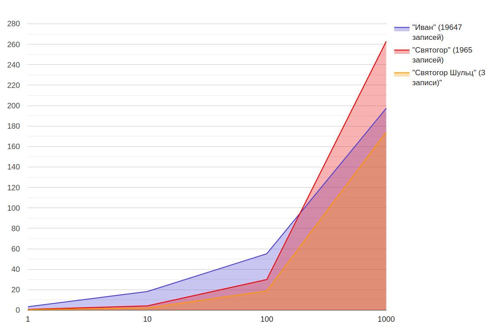
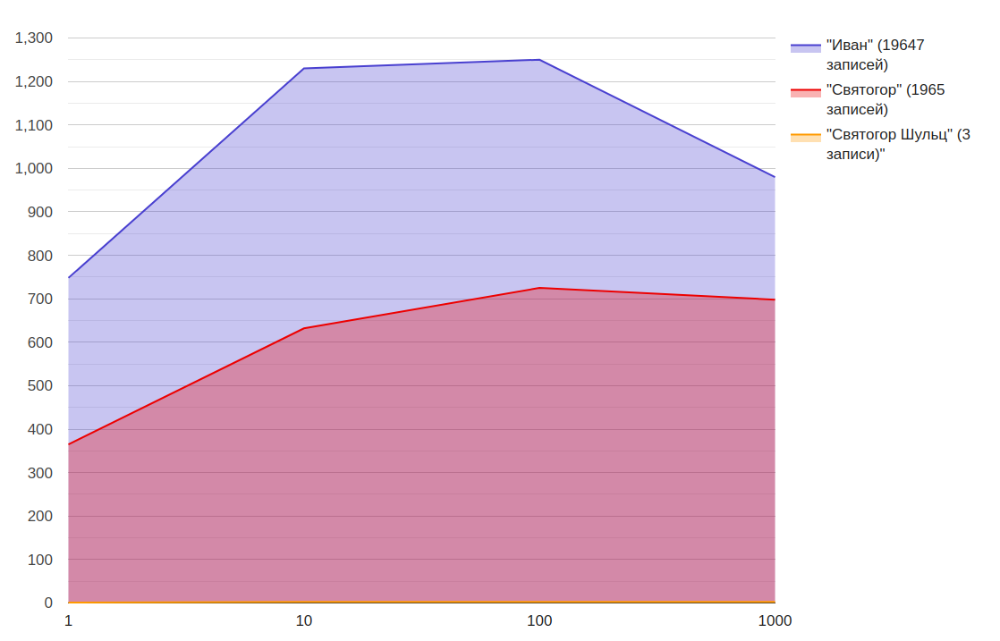
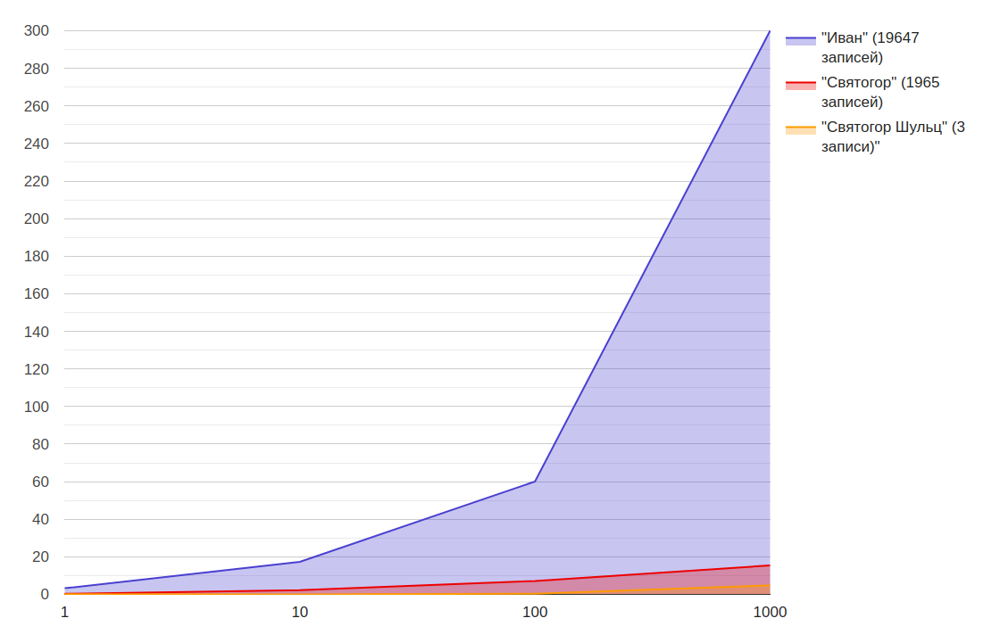
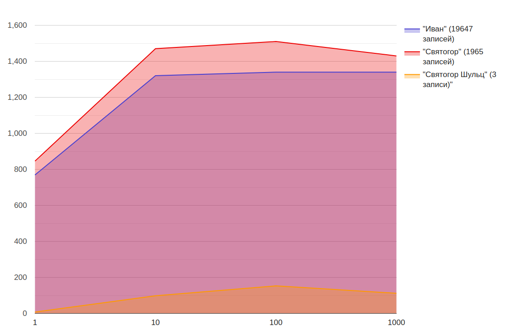
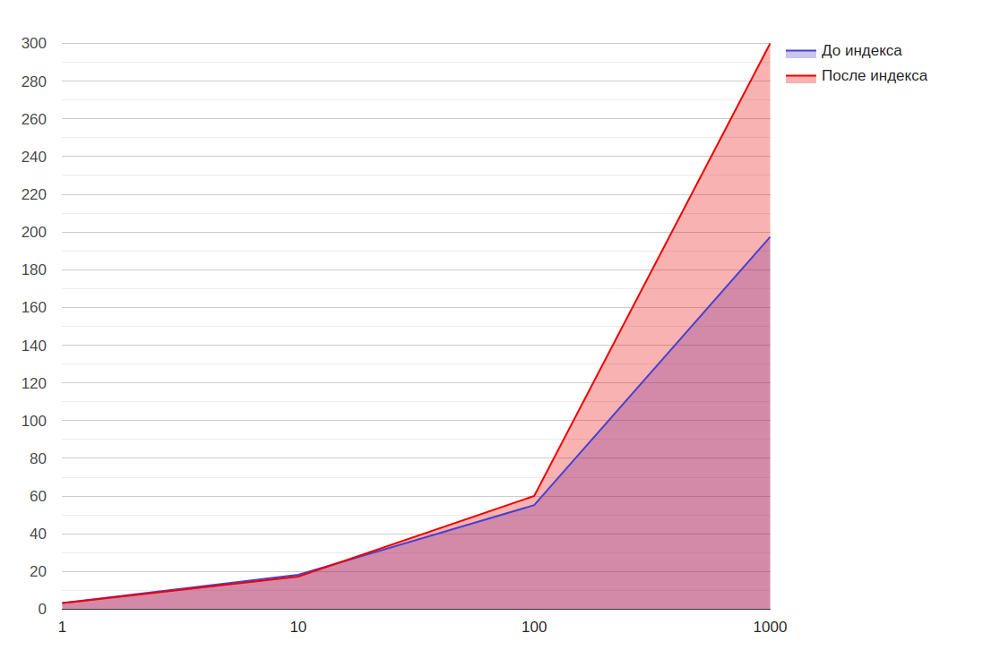
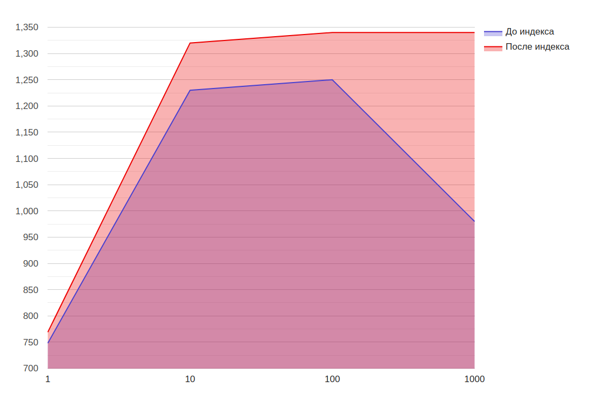
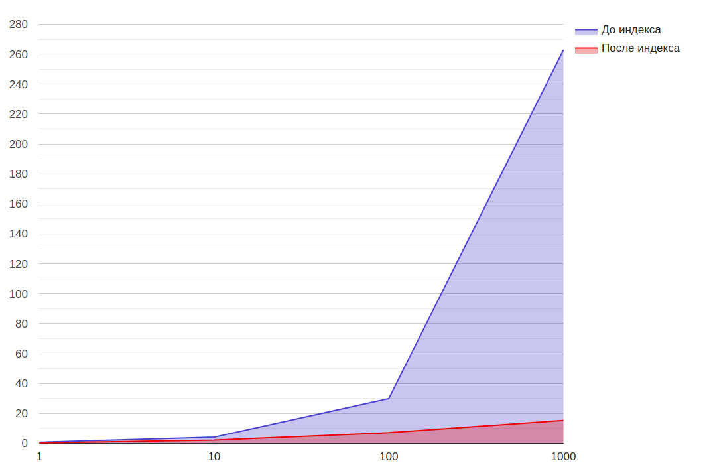
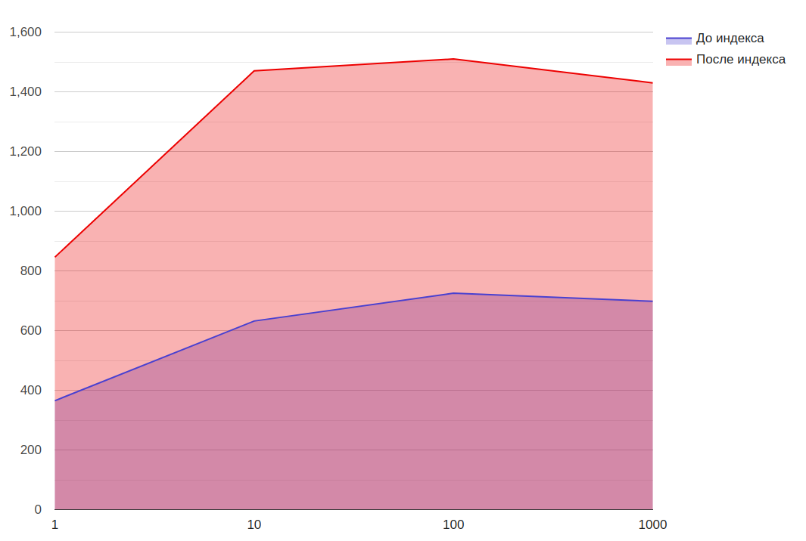
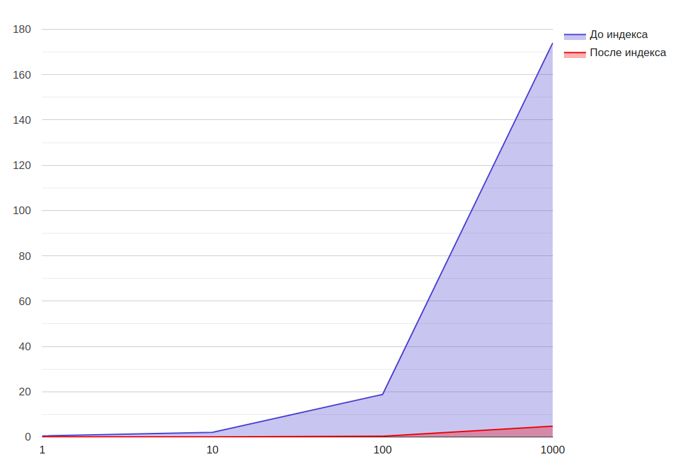
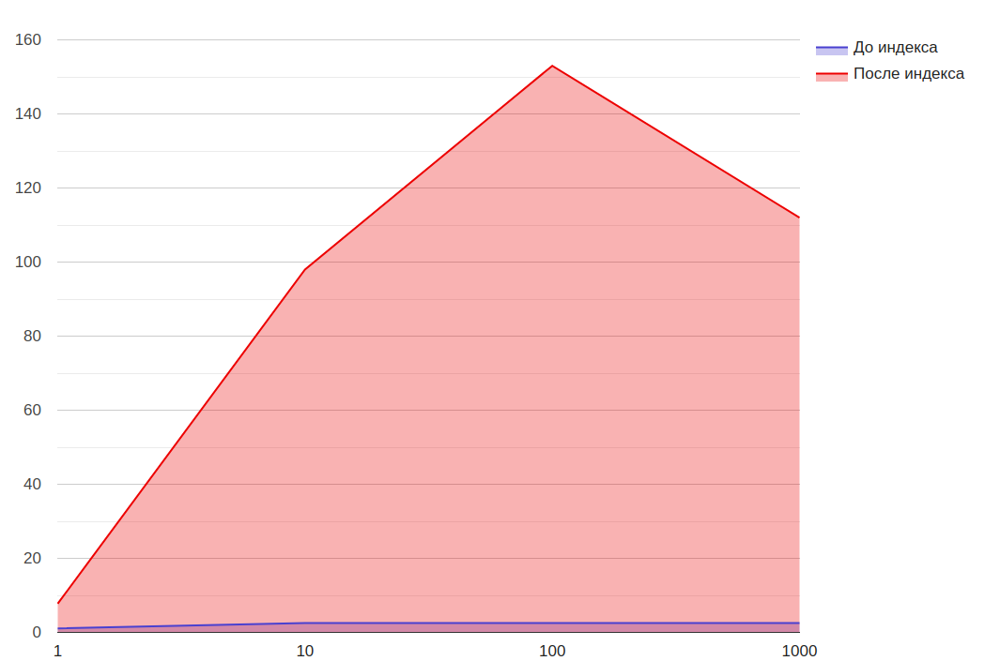

# Отчет по заданию 2 (Индексы)

## Генерация данных

Были сгенерированы 1 000 000 анкет пользователей.  
Имена и фамилии для генерации бали разделены на 3 категории — частые, обычные, редкие, распределенные в соотношении 10 :
5 : 1.

[Скрипт генерации](../social_network/db/fill_database/fill.py)

## Тестируемый эндпоинт

[Сваггер](https://limitless-tor-46576.herokuapp.com/docs#/default/users_api_v1_users__get)

Для нагрузочного тестирования был убран лимит на число сущностей на странице. Так же был добавлен опциональный
параметр `with_hobbies`, чтобы получать или не получать список хобби пользователя.

Запрос, используемый эндпоинтом:

```
SELECT id, first_name, last_name, age, city, gender FROM users
WHERE 
(first_name LIKE UPPER(CONCAT(%s, '%%')))
AND 
(last_name LIKE UPPER(CONCAT(%s, '%%')) OR ISNULL(last_name))
```

(сортировка и пагинация добавляется дополнительно)

## Параметры тестирования

Тестирование было проведено для 3 различных запросов:

1) Имя "Иван" - в тестовых данных считается популярным именем, на 1 000 000 анкет приходится 19 647 записей.
2) Имя "Святогор" - в тестовых данных считается редким именем, на 1 000 000 анкет приходится 1 965 записей.
3) Имя "Святогор" фамилия "Шульц" - в тестовых данных считается редким именем и редкой фамилией, на 1 000 000 анкет
   приходится 3 записи.

Были измерены следующие параметры:

1) Latency (sec)
2) Throughput (KB/sec)

Для каждого запроса менялось количество одновременных подключений - 1, 10, 100, 1 000. Тестирование проходило 2 минуты
для каждой группы, кроме групп с 1 000 подключениями — для них тестирование проходило 5 минут.

## Тестирование до добавления индекса

#### Latency (sec)

| Число подключений  | "Иван" (19 647 записей)  | "Святогор" (1 965 записей) | "Святогор Шульц" (3 записи) |
|:------------- |:---------------:| -------------:| -------------: |
| 1 | 3.35 | 0.74 | 0.49 |
| 10 | 18.27 | 4.2 | 2.07 |
| 100 | 55.2 | 29.97 | 18.79 |
| 1 000 | 197.4 | 262.8 | 174.0 |

##### График



#### Throughput (KB/sec)

| Число подключений  | "Иван" (19 647 записей)  | "Святогор" (1 965 записей) | "Святогор Шульц" (3 записи) |
|:------------- |:---------------:| -------------:| -------------: |
| 1 | 748 | 365 | 1.1 |
| 10 | 1230 | 632 | 2.54|
| 100 | 1250 | 725 | 2.53 |
| 1 000 | 980 | 698 | 2.52 |

##### График



### Выводы

Ввиду отсутствия индекса очевидно, что выборка данных будет выполняться полным проходом по таблице, поэтому время
выполнения запросов не будет слишком различаться. Однако дополнительное изучение эндпоинта показало, что сериализация
данных из сырых строк в модели занимает значительное время и процессорные мощности, что приводит к значительному
приросту времени выполнения запроса на 20 000 строк, по сравнению с запросом на 3 строки (в 3 и более раз). Так же
очевидно, что запросы, получающие большее количество данных имеют больший Throughput.

Однако неожиданно видеть, что запрос на 2 000 в среднем выполнялся дольше, чем запрос на 20 000.

## Добавление индекса

Так как затрагиваются колонки `first_name` и `last_name` очевидно, что необходимо строить индекс по этим колонкам. Между
составным индексом по этим колонкам, и двум разным индексам был выбран второй вариант, как наиболее универсальный
(в первом случае не был бы возможен поиск только по фамилии.)

#### Запрос

```
CREATE INDEX first_name_idx ON users(first_name);
CREATE INDEX last_name_idx ON users(last_name);
```

#### Проверка

Результат `EXPLAIN`:

| id | select\_type | table | partitions | type | possible\_keys | key | key\_len | ref | rows | filtered | Extra |
| :--- | :--- | :--- | :--- | :--- | :--- | :--- | :--- | :--- | :--- | :--- | :--- |
| 1 | SIMPLE | users | NULL | range | first\_name\_idx,last\_name\_idx | last\_name\_idx | 768 | NULL | 1866 | 0.21 | Using index condition; Using where |

## Тестирование после добавления индекса

#### Latency (sec)

| Число подключений  | "Иван" (19 647 записей)  | "Святогор" (1 965 записей) | "Святогор Шульц" (3 записи) |
|:------------- |:---------------:| -------------:| -------------: |
| 1 | 3.27 | 0.322 | 0.069 |
| 10 | 17.31 | 2.22 | 0.054 |
| 100 | 60.1 | 7.17 | 0.352 |
| 1 000 | 300 | 15.44 | 4.78 |

##### График



#### Throughput (KB/sec)

| Число подключений  | "Иван" (19 647 записей)  | "Святогор" (1 965 записей) | "Святогор Шульц" (3 записи) |
|:------------- |:---------------:| -------------:| -------------: |
| 1 | 769 | 846 | 7.76 |
| 10 | 1320 | 1470 | 98|
| 100 | 1340 | 1510 | 153 |
| 1 000 | 1340 | 1430 | 112 |

##### График



## Выводы

### "Иван" (19 647 записей)




Ввиду низкой селективности запроса не наблюдается прироста производительности, более того, она немного снизилась —
возможно связано с тем, что обойти таблицу целиком быстрее, чем собрать результаты из индекса.

### "Святогор" (1 965 записей)




Наблюдается прирост производительности в 2-3 раза (В случае с 1000 подключениями - в 17 раз).

### "Святогор Шульц" (3 записи)




Наблюдается еще больший прирост производительности - в 4 - 5 раз
(В случае с 10000 - в 42 раза).
