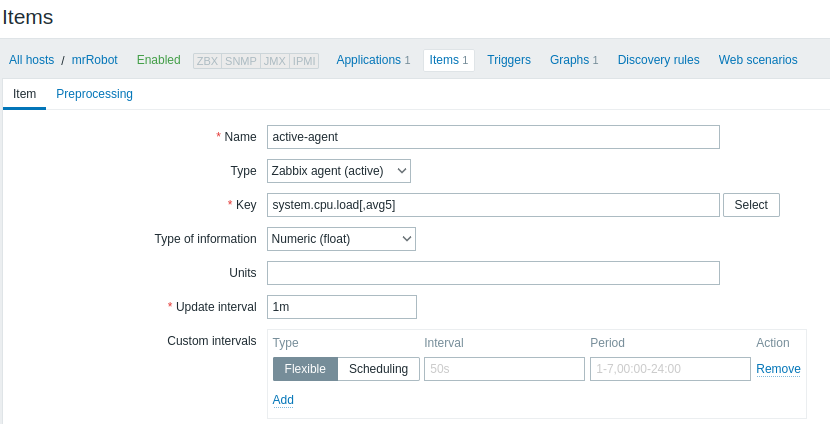

# Отчет по заданию 12 (Метрики)

## Prometheus

На стороне приложения реализуем эндпоинт для сбора метрик. Воспользуемся библиотекой `starlette-exporter`, которая
позволяет обернуть метриками все приложение fastapi из коробки:

```python
from fastapi import FastAPI
from starlette_exporter import PrometheusMiddleware, handle_metrics

app = FastAPI()
app.add_middleware(PrometheusMiddleware)
app.add_route("/metrics", handle_metrics)
```

Проверим работоспособность эндпоинта:


Запустим сервис prometheus с помощью docker:

#### docker-compose

```yaml
  prometheus:
    network_mode: host
    build:
      context: prometheus
      dockerfile: Dockerfile
    container_name: prometheus
    ports:
      - 9090:9090
    command:
      - --config.file=/etc/prometheus/prometheus.yml
```

#### dockerfile

```yaml
FROM prom/prometheus:latest

COPY prometheus.yml /etc/prometheus/prometheus.yml
RUN cd /etc/prometheus && ls -la
```

#### config

```
scrape_configs:
- job_name: messages
  scrape_interval: 5s
  static_configs:
  - targets:
    - localhost:10000
```

(Приложение запускается локально, а не в отдельном контейнере, поэтому используем `network_mode: host`)

Проверим работоспособность:


## Grafana

Запустим grafana с помощью docker:

#### docker-compose

```yaml
    grafana:
    network_mode: host
    image: grafana/grafana:latest
    volumes:
      - grafana_data:/var/lib/grafana
    ports:
      - 3000:3000
```

Подключим источник данных:


Создадим панели для метрик:

#### Rate


#### Errors


#### Duration


С помощью `wrk` создадим нагрузку и протестируем работу дашборда:


## Zabbix

### Сервер
Для функционирования zabbix-сервера необходима база данных:
```yaml
  zabbix-mysql:
    image: mysql
    command: --default-authentication-plugin=mysql_native_password
    container_name: zabbix-mysql
    restart: unless-stopped
    environment:
      MYSQL_USER: zabbix
      MYSQL_PASSWORD: zabbix
      MYSQL_ROOT_PASSWORD: 'zabbix'
    ports:
      - 3116:3306
    volumes:
      - zabbix-mysql-data1:/var/lib/mysql
```

Используем докер для разворачивания сервера:
```yaml
  zabbix-server:
    restart: always
    image: zabbix/zabbix-server-mysql:latest
    ports:
      - 10050:10050
      - 10051:10051
    environment:
      DB_SERVER_HOST: zabbix-mysql
      MYSQL_USER: zabbix
      MYSQL_PASSWORD: zabbix
      MYSQL_ROOT_PASSWORD: 'zabbix'
    depends_on:
      - zabbix-mysql
```

Проверим работоспособность сервера:

```
telnet localhost 10051
Trying 127.0.0.1...
Connected to localhost.
```

### Веб-интерфейс

```yaml
  zabbix-web-new-name:
    image: zabbix/zabbix-web-apache-mysql:latest
    container_name: zabbix-web
    environment:
      DB_SERVER_HOST: zabbix-mysql
      MYSQL_USER: zabbix
      MYSQL_PASSWORD: zabbix
      MYSQL_ROOT_PASSWORD: 'zabbix'
      ZBX_SERVER_HOST: zabbix-server
      PHP_TZ: UTC
    ports:
      - '8080:8080'
      - '443:443'
    links:
      - zabbix-mysql
      - zabbix-server
    depends_on:
      - zabbix-mysql
      - zabbix-server
```

### Агент

Так как сервер развернут в докере у нас нет возможности по умолчанию собирать метрики с локальной машины с приложением (
разумеется это можно настроить). Поэтому сконфигурируем агента в активном режиме, чтобы тот сам отправлял метрики на сервер.

Установим агент:
` apt install zabbix-agent`
Изменим конфигурацию:
```
Server=127.0.0.1
ServerActive=127.0.0.1:10051
```

### Настройка

В веб-интерфейсе необходимо добавить действие autodiscover, чтобы создать хост при подключении активного агента:


Затем найденному хосту нужно добавить items с техническими метриками:



И создать graph для мониторинга:


