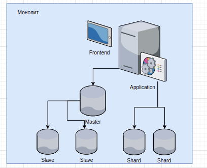
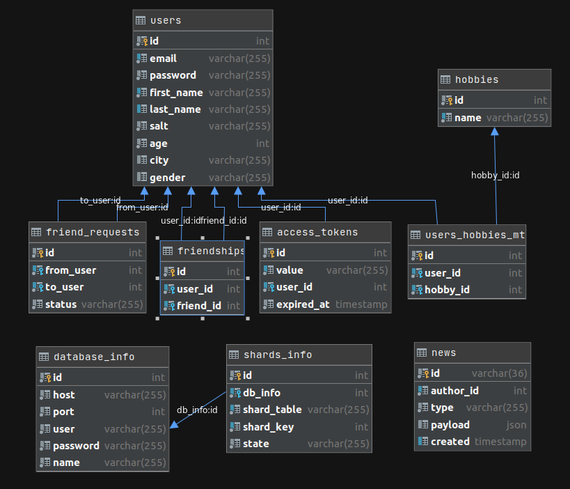
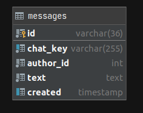
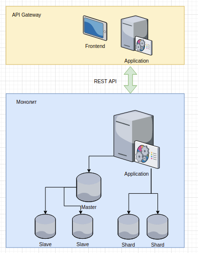
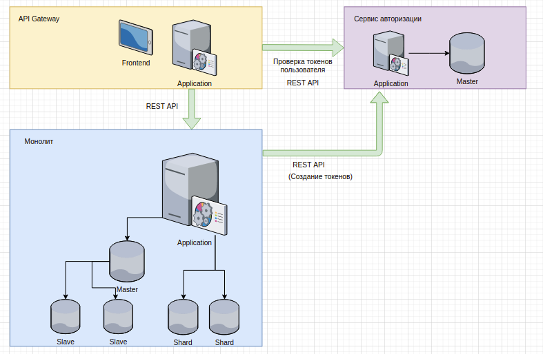
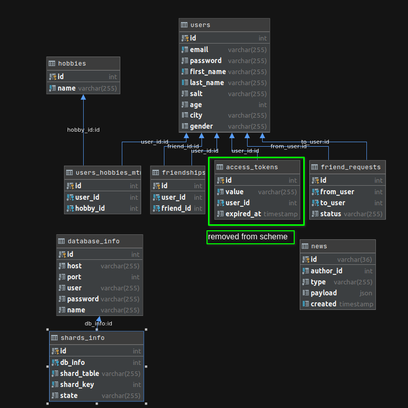
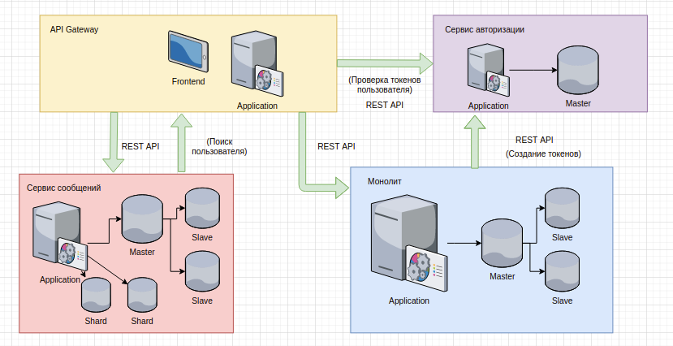
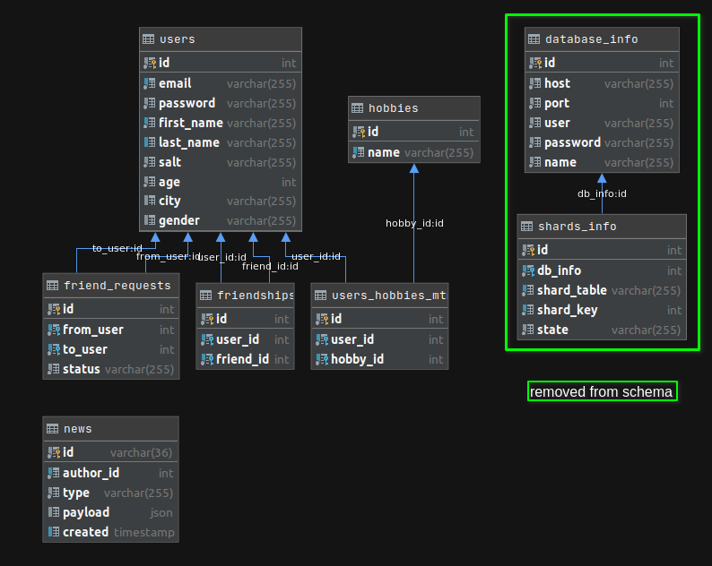

# Отчет по заданию 8 (Разделение на микросервисы)

## Описание существующей архитектуры

На текущий момент приложение представляет собой монолит. Приложение предоставляет api, отдает фронтенд.

Схема:

Приложение использует несколько баз данных - `master` (предусмотрена возможность работы с одной базой, либо с мастером и
несколькими слейвами для распределения нагрузки на чтение) и `shards`, несколько шардов для хранения сообщений
пользователя.

Схема данных (master):

Схема данных (shard):

## Поддержка старого API

Для поддержки старых клиентов в первую очередь реализуется `api gateway`, задача которого поддерживать различные версии
api, служить точкой входа для запросов от клиента. Взаимодействие между гейтвеем и монолитом осуществляется через REST
API.

Так же задача отдачи фронтенда перенесена в гейтвей.

[Сервис](../gateway)

Схема:

## Сервис авторизации

Перед тем, как выделять систему сообщений в отдельный сервис проанализируем зависимости этой области:

1) Авторизация
2) Информация о пользователе

Авторизация на текущий момент использует таблицу `access_tokens`. Чтобы избежать использования совместной базы данных
можно либо вынести авторизацию в отдельный сервис, либо реализовать дополнительные эндпоинты в монолите. Так как скорее
всего мы продолжим разбиение монолита на сервисы, то хотелось бы избежать связанности между монолитом, и каждым другим
сервисом в системе, поэтому примем решение вынести авторизацию в отдельный сервис.

Задача сервиса авторизации - предоставлять возможность создавать токен для пользователя по запросу, а так же проверять
валидность токена пользователя. На текущий момент пароль и логин пользователя находятся в одной таблице с остальными его
данными. Воздержимся от реализации проверки пароля в сервисе авторизации, вместо этого ограничим доступ к сервису только
доверенными хостами (это не реализовано в рамках домашнего задания), и будем считать, что если сервис получил запрос на
создание токена для пользователя, то мы доверяем источнику запроса.

Нет необходимости создавать связь между каждым сервисом и сервисом авторизации - вместо этого проверять токен
пользователя можно в рамках api gateway.

Таким образом, сервис авторизации предоставляет 2 эндпоинта:

- Создание токена для пользователя по его id.
- Проверка валидности токена пользователя, и получение id пользователя по значению токена.

Так же то, что способ генерации токенов абстрагирован в сервисе авторизации позволят в дальнейшем менять механизм
генерации - например использовать jwt-токены вместо генерации и хранения токена в базе.

[Сервис](../auth)

Схема:

Схема данных (master):

## Сервис сообщений

Теперь можно выделить домен сообщений в отдельный сервис. Этот сервис включает в себя:

- эндпоинт списка сообщений
- эндпоинт добавления сообщений
- логику шардинга (единственное место в приложении, где он используется на данный момент)

Так же сервис сообщений зависит от монолита, так как нуждается в проверке, существует ли получатель сообщения. Запрос к
монолиту будет выполняться через гейтвей, что позволит абстрагироваться от изменений в монолите.

[Сервис](../messages)

Схема:

Схема данных (master):

## Что дальше?

Исходя из результатов разбиения монолита возможны следующие дальнейшие шаги:

- Вынос домена новостей из монолита - в главном сервисе остануться продьюсеры кафки, а консьюмеры, кеш новостей,
  вебсокеты (смотри отчеты [очереди](./Queue.md) и [вебсокеты](./Websockets.md))
  и эндпоинты создания/чтения новостей будут помещены в отдельный сервис.

- Разделение таблицы пользователей на 2 части - данные о пользователе, и данные для авторизации, с переносом данных об
  авторизации в сервис авторизации. Таким образом разбиение монолита будет завершено, и приложение будет состоять из 4 "
  равноправных" сервисов - **пользователи** (юзеры, их хобби и друзья), **авторизация**, **новости**, **сообщения**.

- Вынос данных о шардах в отдельный сервис, в случае если шардирование будет использоваться в нескольких сервисах - это
  позволит хранить информацию о шардах в одном месте.
