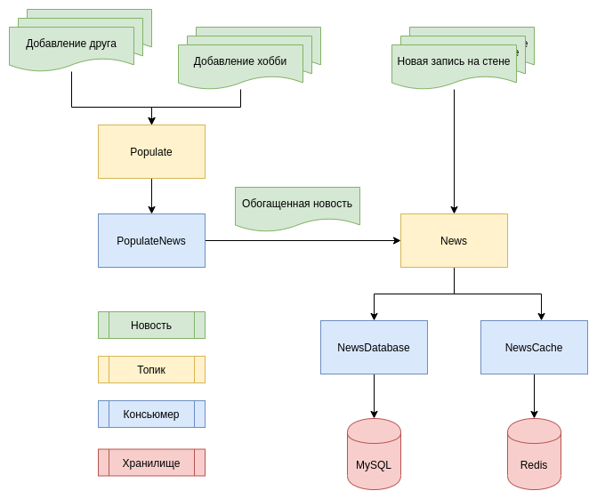

# Отчет по заданию 5 (Очереди)

### Структура новости:

`id` guid  
`author_id` id  
`type` str  
`payload` json  
`created` timestamp

index by `author_id`, `created`

Так же python-объект новости содержит 2 поля - `stored`, означающий, что новость записана в базу данных
и `populated`, означающий, что новость была обогащена данными (смотри ниже.) 

Новости создаются в одном из трех случаев:
1. [Пользователь добавил нового друга](../social_network/web/api/v1/friendships/views.py#L124)
2. [Пользователь добавил себе хобби](../social_network/web/api/v1/users/views.py#L84)
3. [Пользователь добавил запись на стену](../social_network/web/api/v1/news/views.py#L45)

При этом новость не записывается в базу, а добавляется в соответствующий топик в кафку.

### Kafka

#### Структура:

#### Описание:

Для того, чтобы снизить число запросов к базе в поле `payload` новости будем хранить
всю необходимую для отображения на фронте информацию. 

Для новостей о добавлении друга и добавлении хобби из эндпоинтов, обрабатывающих эти
события мы не можем получить всю нужную информацию (имя и фамилия друга, название хобби). 
Мы не хотим получать эти данные из базы в рамках работы эндпоинта, перенесем их получение в очередь.
  
Во время добавления друга/хобби создается запись в топик `Populate`, содержащая id добавляемых сущностей.
На топик подписан [Консьюмер](../social_network/services/kafka/consumers.py#L70), выполняющий запросы
к базе и обогащающий новость. 

После обогащения этот консьюмер пишет новость в следующий топик `News`. Так же, записи в этот консьюмер
пишутся при создании поста на стене (мы имеем все необходимые данные, нет нужды обогащать новость) и
функция, отвечающая за прогрев кеша (смотри ниже).

На топик `News` подписаны 2 консьюмера (в разных группах). [Первый консьюмер](../social_network/services/kafka/consumers.py#L110)
проверяет флаг `stored` у новости, и если он `False`, значит новость еще не записана в базу данных, и консьюмер записывает ее.
В противном случае он не делает ничего.

[Второй консьюмер](../social_network/services/kafka/consumers.py#L127) предназначен для
обновления кеша - он получает список друзей пользователя, и для части из них (точное число конфигурируется) добавляет новость в кеш.

### Redis

В кеше хранится список id всех подписчиков для каждого пользователя, а так же список новостей для ленты.

При добавлении новости в кеш ленты проверяется, что новость:
1. Еще не добавлена в кеш.
2. Если превышен лимит новостей, то таймстамп самой ранней новости меньше, чем таймстамп добавляемой новости. (Это важно для прогрева кеша.)

В случае успеха этих проверок новость добавляется в кеш. 

#### Инвалидация кеша

Список id подписчиков сбрасывается каждые 5 минут.  
Для новостей при добавлении проверяется, не добавляется ли новость сверх лимита. Если добавляется, то сравнивается время
создания этой, и самой ранней из закешированных новостей. Остается самая новая, а самая старая - удаляется.

#### Прогрев кеша

На старте приложения выполняется [прогрев кеша](../social_network/web/utils.py#L9). Из базы извлекаются записи за недавний период (конфигурируется, сейчас это последний день).
Затем они добавляются в топик `News` с флагом `stored`. Таким образом, консьюмер который пишет в базу пропустит их,
а консьюмер редиса - запишет, соблюдая все ограничения, описанные выше.
