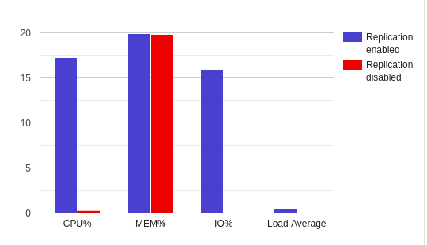

# Отчет по заданию 3 (Репликация)

## Настройка репликации

Созданы 2 виртуальные машины, на них установлен mysql-server.

#### Конфигурация mysql для мастера:

```yaml
bind-address = *
server-id = 1
log_bin = /var/log/mysql/mysql-bin.log
binlog_do_db = otus
```

#### Конфигурация mysql для слейва:

```yaml
server-id = 2
relay-log = /var/log/mysql/mysql-relay-bin.log
log_bin = /var/log/mysql/mysql-bin.log
binlog_do_db = newdatabase
```

#### Команды, выполняемые на мастере:

```sql
GRANT REPLICATION SLAVE ON *.* TO 'slave'@'%' IDENTIFIED BY 'password';
```

#### Команды, выполняемые на слейве:

```sql
CHANGE MASTER TO
    MASTER_HOST ='host',
    MASTER_USER ='slave',
    MASTER_PASSWORD ='password',
    MASTER_LOG_FILE ='mysql-bin.000001',
    MASTER_LOG_POS = 999;
START SLAVE;
```

#### Результаты

```sql
SHOW MASTER STATUS \G;
```

```yaml
File: mysql-bin.000019
Position: 196
Binlog_Do_DB: otus
Binlog_Ignore_DB: 
```

```sql
SHOW SLAVE STATUS \G;
```

```yaml
Slave_IO_State: Waiting for master to send event
Master_Host: 192.168.0.25
Master_User: slave
...
Master_Log_File: mysql-bin.000019
Read_Master_Log_Pos: 196
Relay_Log_File: mysql-relay-bin.000011
Relay-Log-Pos: 411
Slave_IO_Running: Yes
Slave_SQL_Running: Yes
Replicate_Do_DB: otus
...
Slave_SQL_Running_State: Slave has read all relay log; waiting for more updates
...
```

## Изменения в приложении

Все запросы на чтение перенесены на чтение со слейвов. (Исключение — запросы, в которых выполняются запись, и
последующее чтение записанных данных - я понимаю, что это антипаттерн, в рамках выполнения задания не исправлял эту
проблему).

В конфигурацию приложения добавлен опциональный параметр `SLAVE_DATABASES` - список настроек для подключения к слейвам.
При старте приложения создаются коннекторы, в случае если запрос на чтение, а этот список не пустой - вместо чтения с
мастера будет выполнено чтение с произвольного слейва (round-robin).

## Тестирование нагрузки

#### Запрос

Для тестирования используется утилита wrk.

##### Параметры:

* Число подключений - 100
* Время теста 1 минута
* Запрос — список пользователей с именем "Роберт" (в базе на 1 000 000 пользователей таких 1 964, пагинацией ограничено
  до 100).

`wrk -c100 -t1 -d1m --timeout 5s "http://localhost:8000/api/v1/users/?first_name=%D0%A0%D0%BE%D0%B1%D0%B5%D1%80%D1%82"`

##### Мастер

| Репликация  | CPU% | MEM% | IO% | Load Average |
|:------------- |:---------------:| -------------:| -------------: | -------------: |
| Выключена | 21.2 | 22.3 | 19.1 | 1.31 |
| Включена | 0.3 | 25.3 | 0.0 | 0.02 |


##### Слейв

| Репликация  | CPU% | MEM% | IO% | Load Average |
|:------------- |:---------------:| -------------:| -------------: | -------------: |
| Выключена | 0.3 | 19.8 | 0.0 | 0.0|
| Включена | 17.2 | 19.9 | 16.0 | 0.42 |



## Проверка потери транзакций при полусинхронной репликации

### Включение Row-based репликации

Мастер и слейв останавливаются, в конфигурационный файл добавляется:
`binlog_format = ROW`

### Включение GTID

Мастер и слейв останавливаются, в конфигурационный файл добавляется:
```yaml
gtid_mode=ON
enforce-gtid-consistency
replicate-do-db = otus
```

### Настройка полусинхронной репликации

На мастере нужно установить плагин:
```sql
INSTALL PLUGIN rpl_semi_sync_master SONAME 'semisync_master.so';
```
И изменить конфигурацию:
```yaml
rpl_semi_sync_master_enabled = 1
```
На слейве установить плагин:
```sql
INSTALL PLUGIN rpl_semi_sync_slave SONAME 'semisync_slave.so'
```
И изменить конфигурацию:
```yaml
rpl_semi_sync_slave_enabled = 1
```
### Проверка потери транзакций при полусинхронной репликации

Для проверки был использован скрипт:
[Скрипт](../social_network/db/fill_database/create_hobbies.py)

В процессе работы скрипта на мастере убивался процесс mysqld.

`sudo kill -9 <pid>`

Затем слейв промоутился до мастера:

```sql
STOP SLAVE;
RESET MASTER;
```

```sql
SHOW MASTER STATUS \G;
```

```yaml
File: mysql-bin.000001
Position: 156
Binlog_Do_DB: otus
Binlog_Ignore_DB: 
```
```sql
SHOW SLAVE STATUS \G;
```

```yaml
...
Slave_IO_Running: No
Slave_SQL_Running: No
...
```

Второй слейв переключался на него:

```sql
CHANGE MASTER TO MASTER_HOST = 'slave1';

```


Сравнивалось число строк, полученных из скрипта с числом строк на слейве.
```
>>> python3 create_hobbies.py
Final: 15043
```
```sql
SELECT COUNT(*) FROM hobbies;
```
```15043```

По результатам нескольких тестов потерь транзакций не обнаружено.
